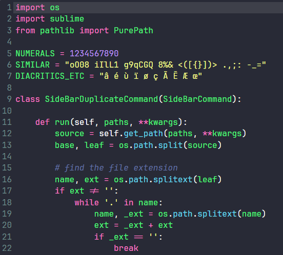
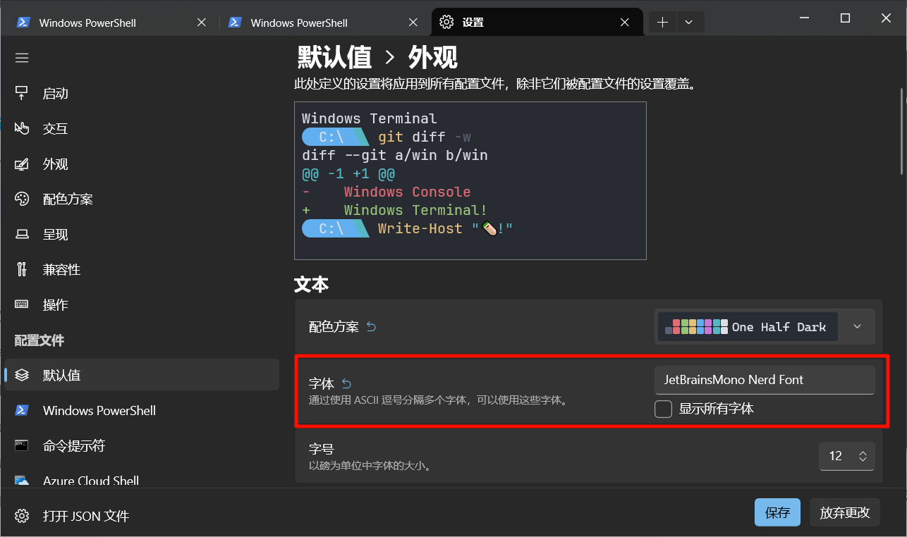

# zsh和oh-my-zsh的安装与配置

> [!NOTE]
> 新增了一键安装脚本：
> `sh -c "$(curl -fsSL https://d.xinit.xyz/scripts/zsh.sh)"`
> 或：`sh -c "$(wget -qO- https://d.xinit.xyz/scripts/zsh.sh)"`

## 安装

一键全装

<!-- 使用圆括号将命令合并为一个命令，避免多个历史记录 -->
```bash
(
printf "请输入 HTTP/HTTPS 代理地址（格式如 192.168.120.1:8080，回车跳过）: "
read -r proxy_input

if [ -n "$proxy_input" ]; then
        export http_proxy="http://$proxy_input"
        export https_proxy="http://$proxy_input"
        echo "已设置代理: http_proxy=$http_proxy, https_proxy=$https_proxy"
else
    echo "跳过设置代理"
fi
# 安装zsh和插件
sudo apt install zsh curl git
[ -d ~/.oh-my-zsh ] && rm -rf ~/.oh-my-zsh
sh -c "$(curl -fsSL https://raw.githubusercontent.com/ohmyzsh/ohmyzsh/master/tools/install.sh)" "" --unattended
git clone https://github.com/zsh-users/zsh-syntax-highlighting.git ${ZSH_CUSTOM:-~/.oh-my-zsh/custom}/plugins/zsh-syntax-highlighting
git clone https://github.com/zsh-users/zsh-autosuggestions.git ${ZSH_CUSTOM:-~/.oh-my-zsh/custom}/plugins/zsh-autosuggestions
git clone https://github.com/zsh-users/zsh-completions.git ${ZSH_CUSTOM:-${ZSH:-~/.oh-my-zsh}/custom}/plugins/zsh-completions
git clone https://github.com/zsh-users/zsh-history-substring-search ${ZSH_CUSTOM:-~/.oh-my-zsh/custom}/plugins/zsh-history-substring-search
git clone --depth 1 https://github.com/marlonrichert/zsh-autocomplete.git ${ZSH_CUSTOM:-~/.oh-my-zsh/custom}/plugins/zsh-autocomplete
echo -e "\e[1;37;42m install zsh and oh-my-zsh plugins ok! \e[0m"
echo -e "\e[1;37;42m changing default shell \e[0m"
echo -e "\e[1;37;42m please enter your password: \e[0m"
chsh -s $(which zsh)
)
```

安装zsh

> *使用`sudo`命令安装zsh时需要添加`-E`参数代理才能生效*

```sh
sudo apt install zsh
```

安装ohmyzsh

```sh
sh -c "$(curl -fsSL https://raw.githubusercontent.com/ohmyzsh/ohmyzsh/master/tools/install.sh)"
```

安装ohmyzsh插件

1. zsh-syntax-highlighting：提供语法高亮和命令检查
```sh
git clone https://github.com/zsh-users/zsh-syntax-highlighting.git ${ZSH_CUSTOM:-~/.oh-my-zsh/custom}/plugins/zsh-syntax-highlighting
```
2. zsh-autosuggestions：提供历史命令和tab补全的提示
```sh
git clone https://github.com/zsh-users/zsh-autosuggestions.git ${ZSH_CUSTOM:-~/.oh-my-zsh/custom}/plugins/zsh-autosuggestions
```
3. zsh-completions：提供额外的tab补全
```sh
git clone https://github.com/zsh-users/zsh-completions.git ${ZSH_CUSTOM:-${ZSH:-~/.oh-my-zsh}/custom}/plugins/zsh-completions
```
4. zsh-history-substring-search：提供历史命令的模糊搜索
```sh
git clone https://github.com/zsh-users/zsh-history-substring-search ${ZSH_CUSTOM:-~/.oh-my-zsh/custom}/plugins/zsh-history-substring-search

###### 以下为可选安装：


1. zsh-autocomplete：提供自动提示和补全，相比zsh-autosuggestions功能更强大更复杂（可选）
```sh
git clone --depth 1 https://github.com/marlonrichert/zsh-autocomplete.git ${ZSH_CUSTOM:-~/.oh-my-zsh/custom}/plugins/zsh-autocomplete
```

2. 安装power10k主题（可选）
```sh
git clone --depth=1 https://gitee.com/romkatv/powerlevel10k.git ${ZSH_CUSTOM:-$HOME/.oh-my-zsh/custom}/themes/powerlevel10k
```

## zsh配置文件修改


编辑文件`~/.zshrc`

- 找到`ZSH_THEME=...`，修改为你自己喜欢的[主题名](https://github.com/ohmyzsh/ohmyzsh/wiki/Themes)，例如
```sh
# 在这里查找和预览其他主题：https://github.com/ohmyzsh/ohmyzsh/wiki/Themes
ZSH_THEME="candy"
```
或者
```sh
# 安装了power10k的话可以按如下设置
ZSH_THEME="powerlevel10k"
```

- 往下翻找到`plugins=...`，配置zsh插件，将原有的
    ```sh
    plugins=(git)

    source $ZSH/oh-my-zsh.sh
    ```
    替换为
    ```sh
    # 一定要覆盖原有的plugins配置
    plugins=(
            git # git的aliases
            sudo # 双击esc切换sudo执行
            z # 输入模糊路径，使用z命令一键跳转到历史目录
            extract # 解压任意压缩包
            zsh-completions
            zsh-autosuggestions
            zsh-syntax-highlighting
            zsh-history-substring-search
            # zsh-autocomplete # 这个插件有点花哨，可以不用
            )
    #zsh-completions config before source onmyzsh
    #下面这两行要在`source $ZSH/oh-my-zsh.sh`这之前添加上
    fpath+=${ZSH_CUSTOM:-${ZSH:-~/.oh-my-zsh}/custom}/plugins/zsh-completions/src
    autoload -U compinit && compinit

    source $ZSH/oh-my-zsh.sh
    ZSH_THEME_TERM_TITLE_IDLE="%n@%m:%~"  # 修改终端窗口标题，空闲时显示：用户名@主机名:当前目录
    ZSH_THEME_TERM_TAB_TITLE_IDLE="%n@%m:%~"  # 上面这个可能不生效，这个可能会生效

    # zsh-history-substring-search的上下方向键键位绑定，可以绑定到其他键位
    # 输入模糊指令后按方向上键搜索历史输入指令
    # see as: https://github.com/zsh-users/zsh-history-substring-search
    bindkey "$terminfo[kcuu1]" history-substring-search-up
    bindkey "$terminfo[kcud1]" history-substring-search-down

    # 设置提示策略
    export ZSH_AUTOSUGGEST_STRATEGY=(history completion)

    # zsh-autocomplete提示延迟一定时间
    zstyle ':autocomplete:*' delay 0.5  # seconds (float)
    # 开启通配符
    setopt nonomatch
    ```


## .zshrc中的ros 环境配置

> 添加到`~/.zshrc`最后面
>
> zsh对ROS需要安装额外的自动补全插件，使用`sudo apt install python3-argcomplete`安装

zsh的代码：
```bash
rosup(){
        #pushd install > /dev/null
        source /opt/ros/humble/setup.zsh
        if [ $? ]
        then
                result="[OK]"
        else
                result="[Failed]"
        fi
        printf "%-40s %-5s\n" "sourcing /opt/ros/humble/setup.zsh" "$result"
        #popd > /dev/null
        #source local_setup
        if [ -e "install/local_setup.zsh" ]
        then
                pushd install > /dev/null
                source local_setup.zsh
                if [ $? ]
                then
                        result="[OK]"
                else
                        result="[Failed]"
                fi
                printf "%-40s %-5s\n" "sourcing local_setup.zsh" "$result"
                #if [ $? ];then printf "%-40s %-5s\n" "sourcing local_setup.zsh" "[OK]";fi
                popd > /dev/null
        else
                echo "no install/local_setup.zsh found"
        fi
        # autocomplete for ros2 and colcon
        # need install python3-argcomplete by apt
        eval "$(register-python-argcomplete3 ros2)"
        eval "$(register-python-argcomplete3 colcon)"
}
```

自动激活ros环境，有兼容问题暂不推荐使用
```sh
# 自动source ros环境，目前不建议使用
if [ -e "install/local_setup.zsh" ]
then
        read -k 1 "s?source local_setup.zsh( y /default n)? "
        echo "\r"
        if [ -n $s ]
        then
                if [ $s == 'y' -o $s == 'Y' ]
                then
                        rosup
                fi
        fi
fi
```

如果需要在bash中使用（如root用户），将这些代码粘贴到`~/.bashrc`:
```bash
rosup(){
        #pushd install > /dev/null
        source /opt/ros/humble/setup.bash
        if [ $? ]
        then
                result="[OK]"
        else
                result="[Failed]"
        fi
        printf "%-40s %-5s\n" "sourcing /opt/ros/humble/setup.bash" "$result"
        #popd > /dev/null
        #source local_setup
        if [ -e "install/local_setup.bash" ]
        then
                pushd install > /dev/null
                source local_setup.bash
                if [ $? ]
                then
                        result="[OK]"
                else
                        result="[Failed]"
                fi
                printf "%-40s %-5s\n" "sourcing local_setup.bash" "$result"
                #if [ $? ];then printf "%-40s %-5s\n" "sourcing local_setup.zsh" "[OK]";fi
                popd > /dev/null
        else
                echo "no install/local_setup.bash found"
        fi
}
# 自动source ros环境，不建议使用
# if [ -e "install/local_setup.bash" ]
# then
#         read -n 1 -p "source local_setup.bash( y /default n)? " s
#         echo "\r"
#         if [ -n $s ]
#         then
#                 if [ $s == 'y' -o $s == 'Y' ]
#                 then
#                         rosup
#                 fi
#         fi
# fi
```

## 终端字体设置

### 字体安装

1. **推荐（等宽字体）：Jetbrains Mono Nerd Font**

    [预览](https://www.programmingfonts.org/#jetbrainsmono)
    [下载](https://github.com/ryanoasis/nerd-fonts/releases/download/v3.4.0/JetBrainsMono.zip)

    
2. MesloLG Nerd Font

    [预览](https://www.programmingfonts.org/#meslo)
    [下载](https://github.com/ryanoasis/nerd-fonts/releases/download/v3.4.0/Meslo.zip)

#### Windows
Windows下解压所有ttf字体文件后全选`ttf文件`右键安装即可

#### Linux

一键下载安装命令：
```bash
wget https://github.com/ryanoasis/nerd-fonts/releases/download/v3.4.0/JetBrainsMono.zip -O JetBrainsMono.zip
unzip -d JetBrainsMono JetBrainsMono.zip
sudo mkdir -p /usr/share/fonts/JetBrainsMonoNF
sudo cp JetBrainsMono/JetBrainsMonoNerdFont-Regular.ttf /usr/share/fonts/JetBrainsMonoNF/
# 刷新字体缓存
sudo fc-cache -fv
# 检查是否安装上字体文件
fc-list | grep JetBrains
```

### Vscode集成终端配置
在设置中搜索`终端 字体`，第一个选项就是终端的字体设置，输入`JetBrainsMono Nerd Font, MesloLGM Nerd Font, monospace`
> 逗号分割多个字体，会从第一个往后依次检索系统已安装的字体使用

或者直接在`settings.json`中添加
```json
"terminal.integrated.fontFamily": "JetBrainsMono Nerd Font, MesloLGM Nerd Font, monospace"

```


### Windows Terminal（终端）配置
在 设置 > 默认值 > 外观 下有字体设置



输入`JetBrainsMono Nerd Font`或点击输入框后会显示系统所有已安装字体，选择JetBrainsMono Nerd Font即可


## other

这些不用设置

MVS环境配置，放在最下面：
```zsh
alias temp1=sudo cat /sys/class/thermal/thermal_zone1/temp
alias temp0=sudo cat /sys/class/thermal/thermal_zone0/temp
alias vnc=tigervncserver -localhost no
export MVCAM_SDK_PATH=/opt/MVS

export MVCAM_COMMON_RUNENV=/opt/MVS/lib

export MVCAM_GENICAM_CLPROTOCOL=/opt/MVS/lib/CLProtocol

export ALLUSERSPROFILE=/opt/MVS/MVFG
export LD_LIBRARY_PATH=/opt/MVS/lib/aarch64:$LD_LIBRARY_PATH
```
