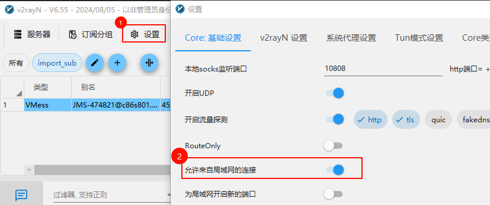
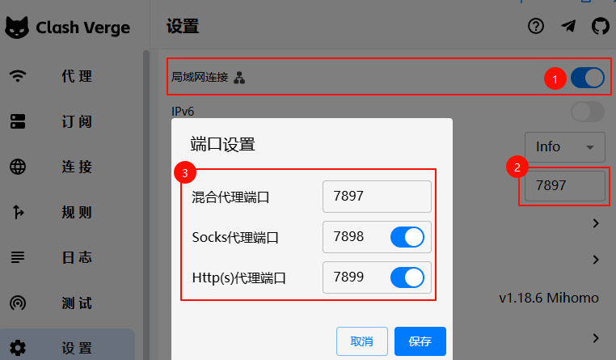

## 在终端中设置http/https代理

通过临时导出环境变量http_proxy和https_proxy来让命令行程序读取代理设置，<span style="color:red;">导出的环境变量仅在当前终端会话有效</span>，在其他终端或重新打开终端失效

假设我的**本机**代理服务器地址为`127.0.0.1:10808` （`v2ray`一般是`10808`，`clash`一般是`7890`），**请一定要根据自己的代理软件中的端口来设置代理**
<!-- tabs:start -->
#### **Windows**
设置环境变量：
- cmd
```sh
set http_proxy="http://127.0.0.1:10808"
set https_proxy="http://127.0.0.1:10808"
```
<!-- # 或者可以像这样一行设置好
set PROXY="http://127.0.0.1:10808" && set http_proxy=%PROXY% && set https_proxy=%PROXY% -->
- powershell
```sh
$env:http_proxy="http://127.0.0.1:10808"
$env:https_proxy="http://127.0.0.1:10808"
```
<!-- # 或者可以像这样一行设置好
$env:PROXY="http://127.0.0.1:10808"; $env:http_proxy=$env:PROXY; $env:https_proxy=$env:PROXY -->

#### **Linux**
设置环境变量：
```sh
export http_proxy="http://127.0.0.1:10808" https_proxy="http://127.0.0.1:10808"
```
> [!NOTE]
>  使用`sudo`执行命令时，需要给`sudo`加上`-E`参数才能使用刚刚配置的代理环境变量，
>
>  例如`sudo -E apt install wget`


<!-- tabs:end -->

> [!ATTENTION]
注：设置了代理后`ping`命令也不会走代理，`ping`命令是`ICMP`协议不是`http/https`协议，
linux下可以使用`wget google.com`测试代理：

## 为git命令设置ssh代理

```term
$ export http_proxy="http://192.168.120.11:10808" https_proxy="http://192.168.120.11:10808"
$ git clone git@github.com:jhildenbiddle/docsify-tabs.git
正克隆到 'docsify-tabs'...
ssh: Could not resolve hostname github.com: Temporary failure in name resolution
fatal: 无法读取远程仓库。
```
<!-- tabs:start -->

#### **Windows**

找到Git程序的安装目录，将`path\to\Git\mingw64\bin\connect.exe`拷贝到`c:\Windows`中

然后在`c:\Users\<你的用户名>\.ssh\config`中的`github`的配置部分下面添加内容：

```
Host github.com
  # ...
  # 将下方 192.168.120.1:10808 更改为你的代理服务器地址
  ProxyCommand connect -S 192.168.120.1:10808 %h %p
  # ...
```

#### **Linux**

在`~/.ssh/config`中的`github`的配置部分下面添加内容：
```
Host github.com
  # ...
  # 将下方 192.168.120.1:10808 更改为你的代理服务器地址
  ProxyCommand nc -x 192.168.120.1:10808 %h %p
  # ...
```
<!-- tabs:end -->

使用`ssh -T git@github.com`测试能否正确连接上github

```term
$ ssh -T git@github.com
Hi imshixin! You've successfully authenticated, but GitHub does not provide shell access.
```
能够正确识别到用户名且显示`successfully authenticated`说明配置正确

## 设置局域网代理

使用场景：代理软件运行在windows上，在局域网内的另一台linux主机需要使用windows上的代理，则可进行如下配置

### 1. 配置代理软件

开启允许来自局域网的连接

- V2ray: 设置->参数设置， 开启`允许来自局域网的连接`，记住代理软件端口号

    
- Clash Verge（或 Clash for windows）：设置->Clash设置， 开启`局域网连接`，记住代理软件端口号

    

### 2. Windows设置防火墙

在windows中需要手动设置防火墙以允许其他设备访问本机的代理

1. 在 `控制面板\系统和安全\Windows Defender 防火墙`中，点击左侧的高级设置打开高级安全防火墙，
或按`Win+R`后输入`wf.msc`打开高级安全防火墙设置
2. 新建规则，规则类型选择`端口`=》
下一页，协议选择`TCP`，端口选择`特定本地端口`并输入`10808, 10809`（Clash是`7890`，具体请查看软件中的端口设置）=》
下一页，操作选择`允许连接`=》
下一页，配置文件三个多选框`域、专用、公用`都勾选上=》
最后一页，名称描述任意输入，点击完成即可

### 3. linux终端设置代理

假设代理主机A的地址为`192.168.1.12`，设备B的地址为`192.168.1.55`，
代理主机A的代理软件已开启局域网访问，已配置防火墙，代理软件中的端口号为`10808`（http/https/socks5）

则在设备B的终端上设置代理（注意修改ip为windows电脑的ip，端口为代理软件上的端口）：
```sh
export http_proxy="http://192.168.1.12:10808"
export https_proxy="http://192.168.1.12:10808"
```
