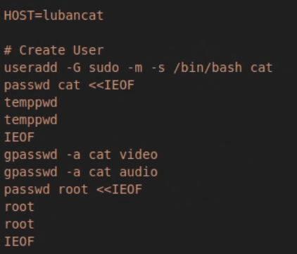

# 鲁班猫镜像打包与烧录

---

> [!NOTE]
>
> **可以去野火官网查看更通用的教程，这个文档会说明一些存在的问题**

## 1. 前置环境配置

**安装SDK依赖的软件包:**

> [!TIP]
>
> 建议代理在**`/etc/apt/apt.conf`**中进行配置, 添加如下代码:
>
> ```bash
> Acquire::http::Proxy "http://<代理IP>:<端口>/";
> Acquire::https::Proxy "http://<代理IP>:<端口>/";
> ```
>
> 如果仅在终端中设置临时代理, 需要在`sudo`后面加上-E

```bash
# 安装SDK构建所需要的软件包
sudo apt-get update && sudo apt-get install git ssh make gcc libssl-dev \
liblz4-tool expect expect-dev g++ patchelf chrpath gawk texinfo chrpath \
diffstat binfmt-support qemu-user-static live-build bison flex fakeroot \
cmake gcc-multilib g++-multilib unzip device-tree-compiler ncurses-dev \
libgucharmap-2-90-dev bzip2 expat gpgv2 cpp-aarch64-linux-gnu libgmp-dev \
libmpc-dev bc python-is-python3 python3-pip python2 u-boot-tools curl \
python3-pyelftools dpkg-dev
```

**安装repo**

> repo是google⽤Python脚本写的调⽤git的⼀个脚本，主要是⽤来下载、管理项⽬的软件仓库。

```bash
mkdir ~/bin
curl https://storage.googleapis.com/git-repo-downloads/repo > ~/bin/repo
format=TEXT' |base64 -d > ~/bin/repo
chmod a+x ~/bin/repo
echo PATH=~/bin:$PATH >> ~/.bashrc
source ~/.bashrc
```

执行完上面的命令后来验证repo是否安装成功能正常运行, 如果默认终端是zsh, 记得键入bash切换。

## 2. LubanCat_SDK源码获取

> [!CAUTION]
>
> 获取和构建源码前请确保进行构建的电脑需要至少有30G的空间剩余！！！！！！

在主目录下创建文件夹`LubanCat_SDK`, 并确认python版本为python3

```bash
# 创建源码文件夹
mkdir ~/LubanCat_SDK

# 查看当前Python版本
python -V

# 若为Python2版本或未发现python，则可以用以下方式切换:
# 查看当前系统安装的Python版本有哪些
ls /usr/bin/python*

# 将python链接到python3
sudo ln -sf /usr/bin/python3 /usr/bin/python

# 重新查看默认Python版本
python -V
```

### 2.1 在线获取源码

进行git设置,保证后续代码能顺利进行拉取

```bash
git config --global user.name "your name"
git config --global user.email "your mail"
```

开始在线下载SDK并同步到最新，若网络有问题还是建议参考后续离线获取源码。

> 如果`.repo/repo/repo sync -c`执行时提示网络连接超时，请检查并能否通畅访问github。 确认可以正常访问github的话，可以重复多次执行`.repo/repo/repo sync -c`命令来进行同步。

```bash
cd ~/LubanCat_SDK

# 拉取LubanCat_Linux_Generic_SDK
repo init -u https://github.com/LubanCat/manifests.git -b linux -m lubancat_linux_generic.xml

# 将所有的源码仓库同步到最新版本
.repo/repo/repo sync -c -j4
```

### 2.2 离线获取源码

访问百度网盘资源介绍页面获取SDK源码压缩包：[8-SDK源码压缩包](https://doc.embedfire.com/linux/rk356x/quick_start/zh/latest/quick_start/baidu_cloud/baidu_cloud.html#id1)

> 解压后应该是一个.repo的文件夹，将其复制到LubanCat_SDK下

```bash
# LubanCat_SDK目录下进行
.repo/repo/repo sync -l
```

### 2.3 LubanCat_SDK分步构建

> [!TIP]
>
> 自动构建十分缓慢且有很多东西是不需要去构建的（比如`rootfs.img`），且不容易排查问题，这里只建议分步构建，若需要自动构建可根据野火官网教程去执行。

文档以鲁班猫4为例，若需要构建鲁班猫0的镜像，只需选择和鲁班猫0相关的配置项即可。

在LubanCat_SDK目录下执行：

```bash
# 选择芯片型号与配置文件
./build.sh chip
```

选择需要的芯片型号和对应的配置文件


注意配置文件需要根据所需内核版本、桌面版本以及设备树配置进行修改。

> [!IMPORTANT]
>
> 注意：如果需要构建鲁班猫4的内核6.1.99的ubuntu22.04镜像，并且需要自己修改设备树，需要做如下修改：
>
> 在`./device/rockchip/.chips/rk3588/LubanCat_rk3588_ubuntu_linux6.1_gnome_defconfig`中
>
>
> ```bash
> # RK_BUILDROOT is not set
> # RK_YOCTO is not set
> RK_UBUNTU_HUMBLE=y //需要从FOCAL改为HUMBLE以切换到ubuntu22.04
> RK_ROOTFS_SYSTEM_UBUNTU=y
> RK_KERNEL_PREFERRED="6.1" //修改内核版本为6.1.99
> RK_KERNEL_CFG="lubancat_linux_rk3588_defconfig"
> RK_KERNEL_DTS_NAME="rk3588s-lubancat-4" //修改对应的设备树文件
> RK_KERNEL_EXTBOOT=y
> # RK_RECOVERY is not set
> RK_EXTRA_PARTITION_NUM=0
> RK_PARAMETER="parameter-extboot.txt"
> RK_USE_FIT_IMG=y
> RK_PACKAGE_FILE_CUSTOM=y
> RK_PACKAGE_FILE="package-file-extboot"
> ```
>
> 在`rk3588s-lubancat-4`**（修改为你的需要修改的设备树文件位置）**下添加如下设备树配置(以pps为例)：
>
> ```c++
> # 这里设置pps引脚为GPIO1_D6，上升沿触发
> /{
> /*exist code*/
> 	pps_gpio: pps-gpio {
> 		compatible = "pps-gpio";
> 		pinctrl-names = "default";
> 		pinctrl-0 = <&pps_gpio_pin>;
> 		gpios = <&gpio1 RK_PD6 GPIO_ACTIVE_HIGH>;
> 		assert-rising-edge;
> 		status = "okay";
> 	};
> }
>
> ......
>
> # 绑定引脚控制
> &pinctrl {
> /*exist code*/
>
> 	pps-gpio {
> 		pps_gpio_pin: pps-gpio-pin {
> 			rockchip,pins = <1 RK_PD6 RK_FUNC_GPIO &pcfg_pull_none>;
> 		};
> 	};
> };
> ```

#### 2.3.1 U-Boot构建

```bash
./build.sh uboot
```

构建生成的U-boot镜像为u-boot/uboot.img

#### 2.3.2 Kernel构建

extboot分区内核镜像，要先生成内核deb包，然后再编译内核并将生成的deb包打包进extboot分区。

按顺序执行以下命令，将自动完成 kernel 的构建及打包。

```bash
./build.sh kerneldeb

./build.sh extboot
```

构建生成的kernel镜像为kernel/extboot.img

#### 2.3.3 Rootfs构建

这里需要按照前文配置好`RK-UBUNTU_HUMBLE=y`以构建ubuntu22.04

> [!IMPORTANT]
>
> 需要注意的是，在执行Rootfs构建时，由于脚本会在chroot下执行包安装、用户初始信息设置等操作，因此还需要在执行包安装命令之前设置代理。
>
> 在`mk-ubuntu-rootfs.sh`中对应位置添加：
>
> ```
> # 第184行
> # Fixup owners
> if [ "$ID" -ne 0 ]; then
> /*...exist code...*/
>
> #设置代理
> export http_proxy="http://<代理IP>:<端口>/
> export https_proxy="http://<代理IP>:<端口>/"
>
> #在这之前添加
> # Add embedfire packages source
> /*...exist code...*/
> apt-get upgrade -y
> ```
>
> 在这里可以修改用户名、密码等
>
> 
>
> 当然还可以在chroot下预装一些package，或者将包直接预先安装到`ubuntu(桌面版本)/overlay/opt`下,这里不做演示。

```bash
# 构建Ubuntu
./build.sh ubuntu
```

生成的根文件系统镜像的命名规则是`ubuntu-(SOC型号)-(桌面版本)-rootfs.img`，保存在对应的ubuntu20.04或ubuntu22.04目录下。

刚刚构建生成的rk3588的rootfs镜像为`ubuntu22.04/ubuntu-rk3588-gnome-rootfs.img`，这个镜像还会被软链接到`rockdev/rootfs.img`用于系统镜像打包。

后续如果需要重新构建`rootfs.img`，需要删除`ubuntu22.04/ubuntu-rk3588-gnome-rootfs.img`时后重新构建镜像时才会重新构建根文件系统。

### 2.4 镜像打包

当u-boot，kernel，Rootfs都构建完成以后，需要再执行` ./build.sh firmware `进行固件打包， 主要是检查分区表文件是否存在，各个分区是否与分区表配置对应，并根据配置文件将所有的文件复制或链接到`rockdev/`内。

为了方便镜像的发布，还可以将各个分立的分区打包成一个文件，打包好的文件就能用于烧录了。

```bash
# 固件打包
./build.sh firmware

# 生成update.img
./build.sh updateimg
```

### 2.5 SDK配置文件修改

可以使用./build.sh config命令来修改SDK配置文件


`./build.sh savedefconfig`命令可以将最小SDK配置文件保存在选择的配置文件里

> 在SDK配置中，可以对rootfs、loader、kernel、分区表、扩展分区、镜像打包等各部分做详细配置， 不过一般情况下直接使用已经保存好的配置文件即可,修改可能会导致编译失败。

## 3. 修改原镜像以添加设备树

将kernel，dtb，dtbo打包进了rootfs内，这样更为通用且更换其中如何一部分只需将文件替换即可。

> 

将img镜像文件拷贝到PC的ubuntu系统下，以 `2025-05-12-ubuntu-22.04.5-desktop-arm64-lubancat-4.img  ` 文件为例

进入GNU Parted并查看分区情况

```bash
❯ parted 2025-05-12-ubuntu-22.04.5-desktop-arm64-lubancat-4.img
警告：您不是超级用户。注意权限问题。
GNU Parted 3.4
使用 /home/jhua/2025-05-12-ubuntu-22.04.5-desktop-arm64-lubancat-4.img
欢迎使用 GNU Parted！输入 'help' 来查看命令列表。
(parted) unit b
(parted) print
型号： (file)
磁盘 /home/jhua/2025-05-12-ubuntu-22.04.5-desktop-arm64-lubancat-4.img: 10485760000B
扇区大小 (逻辑/物理)：512B/512B
分区表：gpt
磁盘标志：

编号  起始点      结束点        大小         文件系统  名称     标志
 1    16777216B   553648127B    536870912B   fat32     primary  bls_boot
 2    553648128B  10484711423B  9931063296B  ext4      primary

(parted)
```

编号1为boot分区，编号2即为rootfs分区，要修改设备树，需要创建文件夹并将boot分区挂在上去。

```bash
# 创建挂载目录
mkdir LubanCat_ISO

# 挂载分区 offset 即为编号1的起始点去掉B
sudo mount -o loop,offset=16777216 2025-05-12-ubuntu-22.04.5-desktop-arm64-lubancat-4.img ./LubanCat_ISO/
```

将修改好的设备树dtb文件复制到对应分区后，卸载分区即可

```bash
# 复制到对应位置
sudo cp /path_to_dtbfile ~/LubanCat_ISO/dtbs/rockchip

# 卸载分区
sudo umount ./LubanCat_ISO
```

此时得到img镜像已经是修改过的img镜像了

## 4. 镜像烧录

 使用野火官网的RkDevTool工具，注意要使用RKDevTool_v3.15_for_window版本


